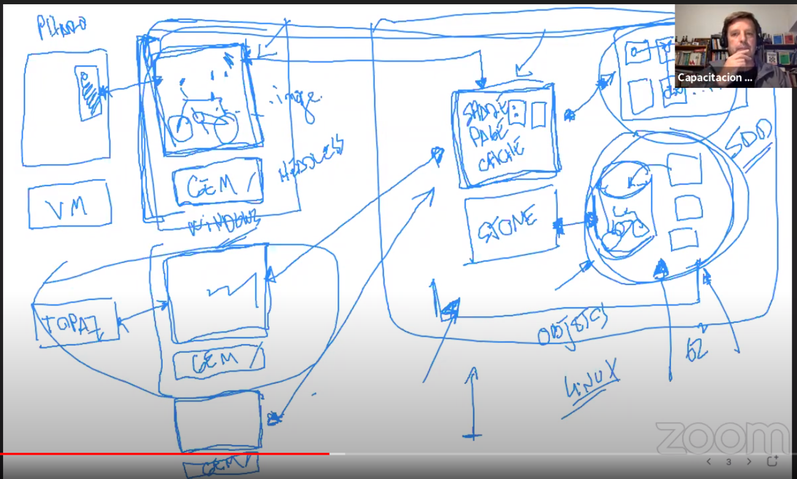

# smalltalk

## Episodio 1

"unarios"
10 factorial.

"binarios"
10 + 20.
10 >=20.

"keywords"
10 gcd: 20.
10 raisedTo: (3 gcd: 2) modulo: 4.

Array with:10 with:10 with:10.

FixedGregorianDate yearNumber: 2020 monthNumber: 3 dayNumber: 24.
March/24/2020 at: 19:50.
3/24/2020.

"
En sintaxis C este seria un if
if(numero.even()) {
	System.out.println('es par'); }
else {
	System.out.println('es impar'); }
"
numero := (FillInTheBlankMorph  request: 'Ingresa un numero') asNumber.
numero even ifTrue: [self informBlockingUI: 'es par'] ifFalse: [self informBlockingUI: 'es impar'].

"
while(numero.even()) {
	System.out.println('ingresar numero impar');
	numero := (FillInTheBlankMorph  request: 'Ingresa un numero') asNumber.
}
"
[numero := (FillInTheBlankMorph  request: 'Ingresa un numero') asNumber.	
numero even] whileTrue: [
	self informBlockingUI: 'ingresar un numero impar'.].
  
## Episodio 2

"
o m |
(o m) |
v := o |
[...] |
^ a
"

11 even ifFalse: [5].
11 even ifFalse: [] ifTrue: [].

[] whileFalse: [].
[] whileTrue: [].
[] whileNil: [].

"
Mensajes -> qué
Metodos -> cómo
"
"
Clasificacion
Objeto instancia de clase
"

10 class.
'Hola' class.
$a class.
false class.

[10 factorial] value. "value es el mensaje para ejecutra el closure o bloque, equivale a 10 factorial."

'hola' = ('ho','la'). "equals"
'hola' == ('ho','la'). "=="

Object subclass: #Customer 
	instanceVariableNames: 'name dateOfBirth' 
	classVariableNames: '' 
	poolDictionaries: '' 
	category: 'Webinar'.
	
"lenguaje dinamicamente tipado"
aCustomer := Customer new.
aCustomer name: 'Pepe'.
aCustomer dateOfBirth: March/24/2020.

aCustomer := Customer2 named: 'pepe' bornOn: March/27/2020.

"La subclasificacion en Java solo vale desde el punto de vista de instanciancias pero no de clases, en smalltalk se puede en ambas"

"Un lenguaje de programacion es el estado del conocimiento de las personas que lo desarrollan"
"Los closures se hicieron famosos porque Java no los tenia"

"Vimos la diferencia entre instancia en clase. Jugamos con el browser, inspector y debuger. Podemos ir modificando un programa mientras esta funcionando"

## Episodio 3

Del Episodio 03: Aprendiendo Smalltalk con Hernan Wilkinson

Lo importante de TDD es escribir tests que nos interesen a los programadores, sin importar si son unitarios, de integración, funcionales, etc

Técnica de desarrollo basada en las características de aprendizaje (no es técnica de testing, se usan tests como herramienta)
* Iterativa e incremental
* Con feedback inmediato

Como side-effect:
* Recuerda todo lo aprendido
* Y permite asegurarnos de no haber "desaprendido"

Incluye análisis, diseño, programación y testing (no en este orden).

¿Cómo se hace TDD?
1. Escribir un test
* Debe ser el mas sencillo que se nos ocurra
* Debe fallar al correrlo
2. Correr todos los tests
* Implementar la solución más simple (no debe abarcar mas que el caso que estamos testeando) que haga pasar el/los test/s
* GOTO 2 hasta que todos los tests pasen
3. Reflexiono - ¿Se puede mejorar el código?
* Si - Refactorizar. GOTO 2
* No - GOTO 1
Este paso es la parte artística de TDD, en donde hacemos que la aplicación se vea bien. No se puede agregar ni sacar funcionalidad, solo refactorizar (no cambia la ejecución del sistema)

Se hacen tests de caja negra que permitan construir la funcionalidad. 

Cada test debe agregar un valor funcional.

Si me demoro mucho en cada paso puede significar que estoy abarcando un test muy grande, que no empecé por el mejor lugar, q el diseño del sistema no es bueno, etc.

En ese ultimo caso significa que debo hacer mas refactors.

REGLA 1: Si el test no falla la primera vez que corre es porque:
a. Estamos testeando algo ya testeado
b. Nos adelantamos en el paso 2

La implementación no debe estar relacionada con datos de prueba sino con casos de prueba.

Casos de prueba = Conjunto de datos de prueba.

Cuando diseñamos un sistema con papel, nosotros estamos corriendo ese sistema en nuestra cabeza. Intentamos ser computadoras pero no lo somos.

Debemos diseñar a alto nivel antes de empezar para particionar el problema funcionalmente. No debemos anticiparnos a crear todo el diseño, el diseño debe surgir ya que así funciona el ciclo de aprendizaje.

Los getter y setter rompen el encapsulamiento.

Lo que no se ejecuta no son mantenibles en el tiempo. UML es muy útil para transmitir conocimiento.

REGLA 2: Sensar el tiempo que nos lleva realizar cada paso.

Esto nos va a dar feedback.

"Programar es el arte de nombrar cosas"

Testing no es una técnica formal para verificar código. No te asegura nada de las cosas que no estas testeando.

El nombre de los tests deben representar reglas de negocio.

Implementación rápida de un algoritmo que factoriza un número:
	
	calculate
		| primeFactors numberToFactorize divisor |
		primeFactors  := OrderedCollection new.
		numberToFactorize := self
		divisor := 2.

		[ numberToFactorize > 1 ] whileTrue: [
			[numberToFactorize isDivisibleBy: divisor] whileTrue: [
					primeFactors add: divisor. 
					numberToFactorize :=  numberToFactorize / divisor].
				divisor := divisor + 1].

		^primeFactors
## Episodio 4

Todas los tests de performance, escalabilidad, seguridad, etc. no son tests que nosotros escribimos con TDD. Son tests que se escriben cuando el sistema/código ya esta hecho, TDD es un proceso de desarrollo.

Los closures son bloques de código que no tienen un nombre asociado (en ocasiones se denominan funciones anónimas). Un bloque es un objeto que representa un conjunto de colaboraciones al igual que un método, la diferencia es que no esta relacionado a una clase y no tiene un nombre.

La función más importante de los closures es poder parametrizar código. Poder pasar como parámetro en un mensaje un conjunto de colaboraciones de manera sencilla. En términos de FP, los closures nos permiten tener funciones de alto orden (funciones que pueden recibir funciones como parámetros).

C: Bloque
Lisp: Funciones lambdas
Closure: Funciones lambdas + binding lexicográfico

Los closures bindean al contexto de ejecución en el cual es instanciado.

Una de las limitaciones de las funciones lambda en Java (que viene heredado de las clases anónimas) es que no pueden modificar objetos del contexto en el cual la función lambda es instanciada. Esto es debido a que esa variable ya no puede vivir en el Stack sino en el Heap. No son closures, son funciones lambda (no son las mismas func. lambda de Lisp). Son syntactic sugar de las clases anónimas.

Un full closure es un closure que el return bindea al contexto de ejecución de donde ese closure esta siendo instanciado.

El sindrome maradoniano es cuando alguien se referencia a si mismo en tercera persona en vez de primera persona (en la clase True de Smalltalk, retornar true en vez de self).

En Smalltalk el mensaje if esta implementado con polimorfismo (en la clase True y False). Cuando se trabaja con objetos, uno intenta evitar el if y usar polimorfismo. Cuando utilizo polimorfismo las decisiones las termina tomando los objetos, cuando utilizo if las decisiones las toma el programador y las hardcodea en el código. Cuando necesito agregar condiciones, solo debo agregar objetos y no modificar la lógica de decisión, me da mayores opciones de ampliar mi diseño sin necesidad de modificar nada (no es un regla, no siempre aplica utilizar polimorfismo sobre if, hay limitantes).

En lenguajes tipo C, algunas sintaxis son construcciones especiales (while, if, try, for, etc), cuando trabajamos en lenguajes consistentes como Smalltalk empezamos a verlo como un conjunto de colaboraciones.

Los lenguajes type recursive detectan y eliminan la cola de la recursión. No necesitan crear un nuevo contexto de ejecución para la implementación de un método recursivo (ej: Haskell).

## Episodio 5

Smalltalk te permite hacer todos, el limite es tu imaginación (incluso puedes debugear el debuger). No leemos archivos o usamos herramientas para las dependencias, solo trabajamos con objetos. Smalltalk fue creado por científicos que te dan todas las libertades, Java evita que te puedas equivocar y por ello te restringen tus libertades (no puedes modificar las clases que vienen con el JDK).

El padre de todos los objetos es ProtoObject que tiene los mensajes mínimos que debe tener un objeto. Object hereda de ProtoObject.

Cuando un objeto recibe un mensaje que no sabe responder, el retorna el mensaje el mensaje doesNotUnderstand. En lenguajes tipados el compilador no te permite enviar mensajes que el objeto no sabe responder.

El patrón MVC fue creado en Smalltalk como un framework. Este resolvía el problema de la interacción hombre maquina con user interface, mouse y teclado. Cada modelo podía tener múltiples vistas. Este framework utiliza lo que hoy en día conocemos como el patrón observer.

Los 23 patrones que vienen del libro de GOF fueron deducidos de soluciones que proponía Smalltalk, pero usaron para los ejemplos a C++. 

Cuando Alan Kay pensó en Smalltalk no pensó en un lenguaje de programación, pensó en una computadora. Smalltalk es mucho mas que un lenguaje.

De Number hereda Integer, Fraction y Float. Se podría trabajar sin float, solo con fraction pero es un poco mas lento. En Smalltalk estamos trabajando con números reales, no tenemos las limitaciones, overflow, problemas de precisión, etc que usualmente tenemos en Java y tampoco es necesario definir el tipo del numero ya que es un lenguaje dinámicamente tipado.

La mayoría de lenguajes de programación tiene implementada solamente la parte aritmética de la matemática, no nos permiten trabajar algebraicamente. El problema es que los números no tienen semántica, son símbolos que representan una abstracción. ¿Qué significa 5? es diferente a decir ¿Qué significa 5 metros? Es la manera de darle semántica a un número.

No debemos quedarnos nunca con lo que el lenguaje de programación nos da. Si el lenguaje no tiene una representación o abstracción que necesitamos, debemos crearla o implementarla. Debemos ir más allá.

Gracias a la extensibilidad de Smalltalk (open close principle), podemos adicionar estas representaciones que el lenguaje no trae y necesitamos. 

En Java no podemos tener nombres de mensajes que sean operadores, de hecho los operadores no son mensajes.

Nil es un objeto global que puede representar infinidad de cosas (de allí viene el problema de tenerlo).

Todas las colecciones vienen de la clase Collection. Puedes crear un array #(10 25 31) o {10 factorial. 3+5. 'hola'} o Array with: 10 factorial with: 3+5 with: 'hola'.

Se usa el mensaje at: para acceder a las posiciones de un array. No existe esa sintaxis [], todo se resuelve por mensajes y objetos.

El for seria asi:

Sintaxis C: for (int i = 0; i < 10; i++) { ... }

En Smalltalk: 0 to 9 do: [ :aNumber | aNumber + 1 ]

0 to 9 crea un intervalo que es una colección.

El mensaje sum lanza un mensaje de error si la colección es vacía. Se puede usar un closure ifEmpty: para manejar el caso en que sea vacía la colección. Se puede hacer reject, collect, select, sum, etc.

Existen Dictionary que permite representar clave y valor (no usarlo cuando se necesita un abstracción).

Tenemos el Set que no permite crear elementos repetidos dentro del Array. Tenemos los Bag que si lo permite y cuenta cuantos elementos hay de cada uno.

String subclasifica Collection. Es una colección de caracteres. Todos los mensajes que tiene una colección los puedo utilizar en un String.

Gemstorm reduce la complejidad accidental que normalmente tenemos con otras bases de datos.

## Episodio 6

Código repetido no es texto repetido, son patrones de colaboración repetido. Para sacar código repetido se copia a un lugar, parametrizo lo que cambia, contextualizo los nombres y lo empiezo a utilizar.

Para parametrizar código, se necesita usar closures o lambdas en caso de Java.

"Una línea en Smalltalk equivale a 5 o 6 líneas en C++"

"[Smalltalk] became the exampler of the new computing, in part, because we were actually trying for a qualitative shift in belief structures--a new Kuhnian paradigm in the same spirit as the invention of the printing press--and thus took highly extreme positions that almost forced these new styles to be invented" - Alan Kay

* Software -> Modelo
* Construir software -> Modelar -> Aprender sobre lo que se modela -> Aprendizaje constructivista
* "millions of potencial users meant that the user interface would have to become a lerning environment along the lines of Montessori and Brunet" -  Alan Kay
* "and needs for large scope, reduction in complexity, and end-user literacy would require that data and control structures be done away within favor of a more biological scheme of protected universal cells interaction only through messages that could mimic any desired behavior" - Alan Kay
* "El lenguaje no es nada, los objetos son todos"

Ej:
* Algebra de Boole - ifTrue:
* Iteraciones - whileTrue:
* Excepciones - on:do: -> redefinir handles:

* "The biggest hit for me while at SAIL in late '69 was to really understand LISP. Of course, every student knew about car, cdr, and cons, but... no one had penetrated the mysteries of eval and apply. I could hardly believe how beautiful and wonderful the idea of LISP was [McCarthy 1960]" - Alan Kay
* "... there were deep flaws in its logical foundations. By this, I mean that the pure language was supposed to be based on functions, but its most important components--such as lambda expressions, qoutes, and conds--were not functions at all, and instead were called special forms" - Alan Kay
* "The actual beauty of LISP came more from the promise of its metastructures than its actual model. I spent a fair amount of time thinking about how objects could be characterized as universal computers without having to have any exceptions in the central metaphor. What seemed to be needed was complete control over what was passed in a message send; in particular, when and in what environment did expressions get evaluated?" - Alan Kay

Meta-xxx: Que habla sobre, que define a, xxx
Ejemplo:
* Una clase es un Meta-objeto porque define su comportamiento
* El español es un "meta-lenguaje" porque puede predicar sobre "si mismo". Ejemplo: "La palabra casa tiene 4 letras"

Sistema computacional: Sistema que actúa y razona sobre un dominio
Casual connection: Propiedad que asegura que cambios en el dominio se ven reflejados en el modelo y viceversa
Mesa-sistema: Sistema cuyo dominio es otro sistema
Sistema Reflexivo: Meta-sistema "casually connected" consigo mismo


Reflexión: Habilidad integral de una entidad para representar, operar sobre y tratar consigo mismo en la misma manera que representa, opera sobre y trata con su sujeto primario
Introspection: La habilidad de un programa de razonar acerca de si mismo y/o la implementación del lenguaje de programación (read)
Intercession: La habilidad de un programa de "actuar" sobre las reificaciones (reificar: hacer un objeto de algo que no lo era) de si mismo y la implementación del lenguaje de programación (write)
Reflexión estructural: La habilidad de un programa de acceder a su representación estructural y la implementación del lenguaje de programación
Reflexión de Comportamiento (Behavioral Reflection): Habilidad de un programa de acceder a la representación dinámica de si mismo, esto es a la ejecución operacional del programa y de la implementación del lenguaje de programación


| | Read | Write |
| :---: | :---: | :---: |
| Structure | All classes<br>Does implement?<br>Design rules? | addInstVarNamed:<br>compile: |
| Behavior | Assertion Name<br>Debugger | Create Method<br>Pluggable Proxy<br>Debugger |


La metaprogramación a nivel comportamiento lectura se utiliza por ejemplo para implementar un debuger. Un debuger lee el stack de ejecución para cada contexto de ejecución.

A nivel comportamiento escritura seria modificar el stack de ejecución mientras se esta ejecutando.

No es bueno usar meta-programación para resolver problemas del dominio de negocio. La meta-programación es como magia, oculta muchas cosas y esto después dificulta el mantenimiento. Hay que tener mucho cuidado de cuando usarla, es una herramienta muy poderosa pero hay que usarla con sabiduría en los contextos correctos. Un buen caso de uso es para crear herramientas para los mismos desarrolladores (debugers, lints, etc).

Para saber si un diseño es bueno se mira que tan declarativo es. Que tan fácil es mappear ese diseño al dominio del problema. Si tengo clases que representan conceptos del dominio del problema probablemente sea un buen diseño. No hay una respuesta única, es algo contextual la pregunta.

```
Object subclasses.
Object allSubclasses size.
Array superclass superclass.

OrderedCollection  instVarNames.
OrderedCollection definition.
OrderedCollection selectors size.
OrderedCollection compiledMethodAt: #removeAll.

"Lineas de codigo de toda la imagen"
Object withAllSubclasses sum: [ :aClass |
	aClass selectors 
		sum: [ :aSelector | 		(aClass compiledMethodAt: aSelector) linesOfCode ]
		ifEmpty: [0]].

Object withAllSubclasses sum: [ :aClass |
	aClass selectors 
		sum: [ :aSelector | 		(aClass compiledMethodAt: aSelector) numberOfCollaborations ]
		ifEmpty: [0]]. 
		
Set allInstances.

Object subclass: #ClaseXX
	instanceVariableNames: '' 
	classVariableNames: ''
	poolDictionaries: ''
	category: 'Webinar'.
	
ClaseXX addInstVarName: 'v1'.
ClaseXX removeInstVarName: 'v1'.

ClaseXX compile: 'm1 ^10'.
ClaseXX removeSelector: #m1.
```

## Episodio 7

Smalltalk es un ambiente de objetos que incluye lenguaje de programación, herramientas de desarrollo, etc.

En lenguajes metacirculares hay que tener cuidado de cometer errores circulares. Por ejemplo no deberia modificar el debugger, deberia subclasificarlo para hacer los cambios hasta asegurarme que este funcionado.

Dentro de los lenguajes de objetos tenemos 2 tipos de implementaciones: los que son de clasificación (esos lenguajes donde hay clases como smalltalk, java, c#, etc) y los lenguajes de prototipación (lenguajes donde no hay clases como self y javascript, aunque javascript esta un poco alejado de la idea de original de prototipos).

Las clases son las que definen el comportamiento de sus instancias. Las clases también son objetos (vienen de Class) y también reciben mensajes. La clase Class define el comportamiento de todas las clases. Esta subclasifica Object y es la que hace que toda clase se comporte como objeto. Class hace parte del metamodelo de Smalltalk. Class es una instancia de ella misma (circular) para evitar regresiones infinitas. La relación entre Object y Class se resuelve al momento del bootstrap, en donde se crean estas cosas y se cambian los punteros para que puedan depender entre ellos. Este es el metamodelo que tenia Smalltalk 76 y que tiene Java. La limitación de este metamodelo es que no puedo tener comportamiento especializado para las clases. Por eso en Java cuando se le quiere dar un comportamiento especializado a la clase (y que no aplique a las instancias) creamos esos métodos estáticos que ya no hacen parte del paradigma de objetos (seria estructurado o procedural, funciones tipo C).


En Java todas las clases son instancias de la clase Class (como el comportamiento que vemos en el metamodelo de la imagen anterior). Esto se puede comprobar al llamar el método getClass:

```
Class<? extends ExampleTest> thisClass = this.getClass();
Class<? extends Example2> thisClass = this.getClass();
// En ambos casos retorna objetos de tipo Class
```

El problema de los métodos estáticos de Java es que no estoy en el mundo de Objetos (no existe el this).

Las clases son instancias de la clase Class. Son construcciones sintácticas, no tengo la posibilidad de fácilmente acceder a ese objeto y definirle comportamiento.

Smalltalk soluciono esto asignándole una clase a cada clase. Se llevo la misma idea de instancia - clase a clase - metaclase. Toda metaclase conoce su única instancia (clase). Esta característica se denomina metaclase implícitas. La clase no puede existir hasta que no tiene una metaclase de la cual va a ser instancia. Las metaclases siguen la misma relación de subclasificación de las clases. ObjectClass subclasifica Class y este subclasifica Behavior. La metaclase de Class se llama ClassClass. Class es una clase abstracta, no tiene instancias, solamente subclases que son todas las clases. Todas las metaclases (ObjectClass, ClassClass, BehaviorClass, DateClass, etc) son objetos y son instancias de Metaclass. La metaclase de Metaclass es MetaclassClass y MetaclassClass es instancia de Metaclass (singularidad (no circularidad) para evitar una regresión al infinito, no podemos determinar quien es quien, uno es instancia del otro y el otro es instancia de si mismo). Behavior subclasifica Object (todo aquello que represente comportamiento se comporta como un objeto).

Existen las metaclases explicitas (en python o en clos (lenguaje de objetos de Lisp)) y significa que puedes a una clase definirle o modificarle su clase.

Todos estos metamodelos salen naturalmente siguiendo el algoritmo de method lookup.

Si queremos ampliar mi metamodelo (como lo hizo Pharo que es otra implementación de Smalltalk). Este tiene el concepto de Trait que son elementos de comportamiento puro que no tienen instancias. Es comparable con las interfaces de Java, pueden tener implementación para esos mensajes. Esto no es tan bueno. Lo que vos pones en una interfaz como implementación por default es como tener herencia múltiple que es algo que se intento evitar en su momento en Java. Las interfaces en Java surgen como manera de representación de tipos puro (definición de tipos). En un lenguaje dinámicamente tipado no tiene sentido tener construcciones que representen tipos puros ya que en ningún momento se hace chequeo de tipos entonces el concepto de Trait hace referencia a grupos de comportamientos cohesivos (no se puede definir estados). El problema con la herencia múltiple viene con el problema del diamante.

Lo que hicieron en Pharo fue subclasificar Behavior con la clase Trait. Una manera de solucionar el problema del diamante de la herencia múltiple se llama mixins que es la técnica que usa ruby por medio de los módulos. 

La ventaja de las metaclases explicitas es que se puede solucionar cosas como el patrón singleton: tener una metaclase singleton y que todas las instancias de esta implementen el patrón, con Smalltalk no se puede hacer esto y toca repetir código para implementar este patrón. La desventaja es todos los retos que puede tener las metaclases explicitas y perder compatibilidad.


```
10 class "SmallInteger"
10 class class "SmallInteger class"
10 class class class "Metaclass"
10 class class class class "Metaclass class"
10 class class class class class "Metaclass"

"Navegando a nivel clases"
10 class superclass "Integer"
10 class superclass superclass "Number"

"Navegando a nivel metaclases"
10 class class "SmallInteger class"
10 class class superclass "Integer class"
10 class class superclass superclass "Number class"
10 class class superclass superclass superclass "Magnitude class"
10 class class superclass superclass superclass superclass "Object class"
10 class class superclass superclass superclass superclass superclass "ProtoObject class"
10 class class superclass superclass superclass superclass superclass superclass "Class"
10 class class superclass superclass superclass superclass superclass superclass superclass "ClassDescription"
10 class class superclass superclass superclass superclass superclass superclass superclass superclass "Behavior"
10 class class superclass superclass superclass superclass superclass superclass superclass superclass superclass "Object"
"Toda clase es en definitiva un Objeto"
```

Se puede recorrer el metamodelo de esa manera.

Self halt. Crea un breakpoint en Smalltalk.

La metaprogramación es para trabajar sobre programas, no sobre dominios de negocio particulares.

El metamodelode Ruby es un poco más simple.

Alan Kay comentaba que si a Platon le comentáramos como es el metamodelo de Smalltalk se revolcaría en su tumba. Esta implementación es muy compleja, se soluciono el problema de darle comportamiento especializado a las clases pero de manera muy compleja. Self es mucho mas simple.

## Episodio 8

En Smalltalk puedo ir construyendo la interfaz dinámicamente, mientras el server se esta ejecutando. No se necesita bajar el servidor, compilar y volver a subirlo. Te permite desarrollar una aplicación web con la misma facilidad que si no fuera web. Todo el dinamismo se mantiene y el desarrollo se acelera mucho.

Existen múltiples frameworks para hacer aplicaciones web: WebClient, Teapot (Pharo), SeaSide, etc.

Las variables de clase son variables que se pueden acceder desde el lado de clase, el lado de instancia y para toda la jerarquía.

Las arquitecturas en general (por ejemplo hexagonal) tratan de estereotipar los distintos tipos de objetos, es algo que pasa en este tipo de soluciones genéricas o usando DDD. Tenes 3 tipos de objetos: A, B y C y todo debes armarlo en base a esa estereotipación. Las decisiones de diseño se deben tomar de manera contextual en base al problema que esta resolviendo. Cuando decís que tenes estos 3 tipos de objetos estas haciendo un reduccionismo muy grande a esa solución/diseño. El problema es que cuando ese reduccionismo a esos 3 tipos de objetos no sirva, la gente no se va a dar cuenta y en vez de pensar en una solución distinta lo que se termina haciendo es tratando de encajar todo en esos 3 tipos de objetos (es como intentar encajar un cuadrado en un circulo). Te brindan una receta que generalmente no escala. Te venden que un diseño aplica para todas las soluciones (balas de plata).

## Episodio 9

Las excepciones checkeadas de Java obligan a romper el encapsulamiento. El que envía el mensaje tiene que saber cuales son las excepciones que se pueden levantar. Eso genera un acoplamiento porque si en algún momento cambio el tipo de excepción, eso impacta en todo el árbol de ejecución. No usar estas excepciones checkeadas.

El hecho de poder definir closures en la condición de handleo (handlear cualquier cosa) me evita tener que crear un montón de clases y una jerarquía de excepciones que no tienen comportamiento especifico.

Con un lenguaje tan consistente como Smalltalk es "simple" implementar un mecanismo de excepciones que use try, catch (mensaje when que pueda recibir un closure para la condición de handleo), resumeWith, retry.

```
"
Sintaxis C
try {
 ...
} catch (Exception e) {
 handler exc.
 1) retornar
2) pasar al proximo handler
}
"

"
Sintaxis Smalltalk (objeto mensaje)
[...]
	when: Exception
	do: [ :anException | handler exc ].
"

[1/0]
	on: Error" - ZeroDivide "
	do: [ :a | 10 ] 10 
```

## Episodio 10


El problema con las bases de datos relacionales es que hablan un lenguaje diferente al de la aplicación, por lo tanto necesito algo (ORM) que me permita traducir del paradigma de objetos al relacional.

Luego las bases de datos empezaron a tener datos + códigos (SP).

Si quieres persistir una bicicleta debes persistir las ruedas en una tabla, el manubrio en otra, etc. y luego al consultar debes reconstruir la bicicleta completa. Mientras en una base de datos de objetos traes la bicicleta completa.


El Stone es lo que permite acceder al objeto y guardar los transaction logs. Los Gem son las virtual machine en donde se ejecuta GemStone.



GemStone brinda bloqueo optimista lo cual evita deadlocks y problemas de concurrencia.


JP Morgan tiene una aplicacion que se llama Capitall y usa GemStone, tiene 3 stones al rededor del mundo.

GemStone es un Smalltalk distribuido. Ventajas: No tengo que preocuparme por el mapeo (ORMs), persistencia (es automática), bloqueo.

GemStone almacena la historia de una clase, por lo cual puedes tener varias instancias con diferentes versiones. Puedo implementar el mensaje DoesNotUnderstand para cuando se llame al mensaje que cambio o es nuevo en una versión del objeto, y que este revise si existe una nueva versión, se migre y luego se vuelve a mandar el mensaje a si mismo.

Cuando se produce un error GemStone guarda el stack de ejecución (es otro objeto), no necesitas guardar logs o librerías (log4j) para hacer esto. El stack de ejecución no es solo texto plano, GemStone guarda una foto del estado actual de los objetos que puedes debuggear. Loggear demuestra la incapacidad que tenemos como desarrolladores. Loggear es una solución a un problema que no debería existir.

El movimiento NoSQL no aporto casi, seguían los mismos problemas, problemas que GemStone si soluciona.
